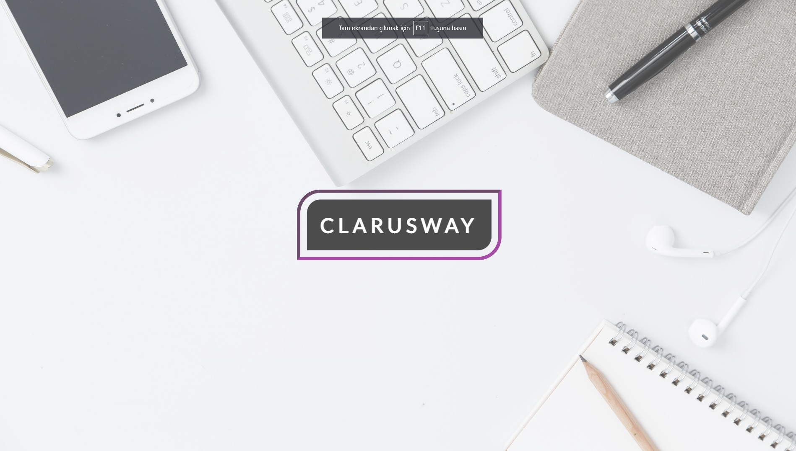

# Parallax Website

This project is a parallax website showcasing various educational programs offered by Clarusway, designed with HTML, CSS, and some JavaScript for parallax effects.

## Features

- **Parallax Scrolling:** Enhances visual appeal and user engagement.
- **Responsive Design:** Ensures compatibility across various devices.
- **Educational Content:** Provides detailed information about Clarusway's programs.
- **Stylish UI:** Uses modern fonts and design elements for a professional look.

## Technologies Used

- HTML5
- CSS3 (including Flexbox and Grid)
- Responsive Design
- Google Fonts API

# Paralaks Web Sitesi

Bu proje, Clarusway tarafından sunulan, HTML, CSS ve paralaks efektleri için bazı JavaScript ile tasarlanmış çeşitli eğitim programlarını gösteren bir paralaks web sitesidir.

## Özellikler

- **Paralaks Kaydırma:** Görsel çekiciliği ve kullanıcı etkileşimini artırır.
- **Duyarlı Tasarım:** Çeşitli cihazlar arasında uyumluluk sağlar.
- **Eğitici İçerik:** Clarusway'in programları hakkında ayrıntılı bilgi sağlar.
- **Şık kullanıcı arayüzü:** Profesyonel bir görünüm için modern yazı tipleri ve tasarım öğeleri kullanır.

## Kullanılan Teknolojiler

-HTML5
- CSS3 (Flexbox ve Grid dahil)
- Duyarlı tasarım
- Google Fonts API

[Canlı Demo'yu Deneyin](https://fatihycan.github.io/Parallax-Web/)
